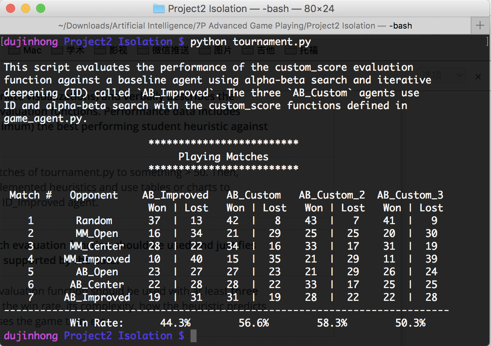
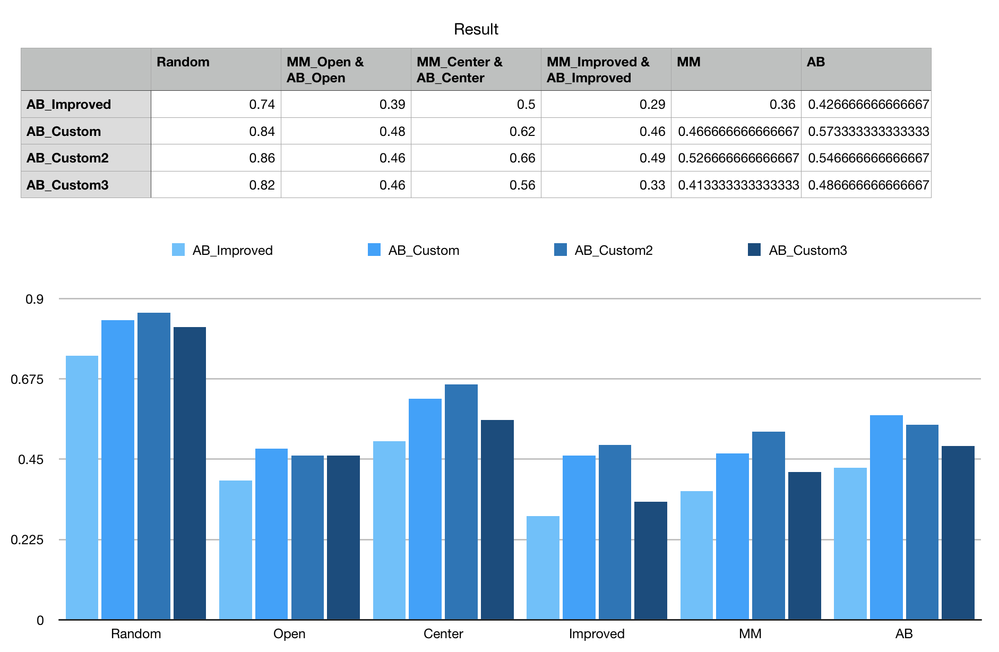
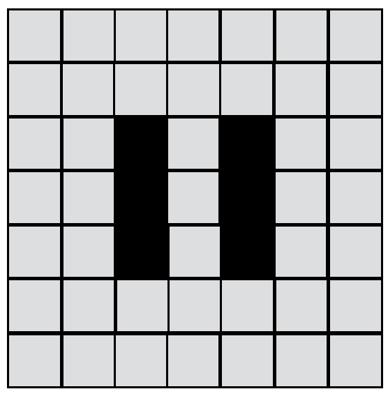

#Heuristic Analysis

## Rssult

We can see the three heuristic function works better than the `AB_Improved` on almost time.

 
## Analysis
* Custom 1

Here I use the piecewise function, using different stages in different situations.

1.When one of the player has won, just return as follows.

	if game.is_loser(player):
        return float("-inf")
        
    if game.is_winner(player):
        return float("inf")

2.When the game just has begun for a short time, $$\dfrac{2}{3}\leqslant \dfrac{blank\_spaces}{total\_spaces}\leqslant 1$$
I would like to force my player to conquer the center of the blank areas. It is because when there are many blank positions on the board, it will be more chioces for the players on such areas instead of the edges of the board. I use the following fomula to calculate the value of the heuristic function at this stage.

$$d=\Vert x-C\Vert_2^2$$

We can call it `improve_center_score`.

3.When the game proceeds for a while,$$\dfrac{1}{3}<\dfrac{blank\_spaces}{total\_spaces}\leqslant \dfrac{2}{3}$$
I would like to combine the `improved_score` and the `improve_center_score`. Using
$$own\_moves-2\times opp\_moves+\dfrac{d}{total\_spaces}$$
to be the value of the heuristic function at this stage. Here the secend term plus by 2 because I want it to be more offensive, the third term divides by `total_spaces` because I want to reduce the influence of the `improve_center_score`, and I still keep it because when the former score give the same value on 2 different positions, the player can choose the better position. 

We can call it `combined_improved_center_score`. 

4.When the space of the board is almost run out, $$0<\dfrac{blank\_spaces}{total\_spaces}\leqslant \dfrac{1}{3}$$the `improved_center_score` is no more work. Now I only want my players to survive and use the strategies of defend, so we only focus on the `open_move_score`
$$own\_moves$$

    center = np.mean(game.get_blank_spaces())
    own_moves = len(game.get_legal_moves(player))
    opp_moves = len(game.get_legal_moves(game.get_opponent(player)))
    blank = len(game.get_blank_spaces())
    if blank >= game.width*game.height/3*2:
        return np.sum((game.get_player_location(player) - center )**2)
    elif blank >= game.width*game.height/3:
        return float(own_moves) - 1.5 * float(opp_moves) + np.sum((game.get_player_location(player) - center )**2)/game.width/game.height
    else:
        return float(own_moves)
---
 
* Custom 2

1.When one of the player has won, just return.

2.When $$\dfrac{1}{2}\leqslant\dfrac{blank\_spaces}{total\_spaces}\leqslant 1$$
use the `combined_improved_center_score` to conquer best positions.

3.When $$0<\dfrac{blank\_spaces}{total\_spaces}< \dfrac{1}{2}$$ use
$$own\_moves+\dfrac{d}{total\_space}$$
as the value of the heuristic function at this stage.

---
 
* Custom 3

1.When one of the player has won, just return.

2.When $$\dfrac{1}{2}\leqslant\dfrac{blank\_spaces}{total\_spaces}\leqslant 1$$use the `combined_improved_center_score` to conquer best positions.

3.When $$0<\dfrac{blank\_spaces}{total\_spaces}<\dfrac{1}{2}$$
 take a more offensive strategies and use
$$own\_moves-1.5\times opp\_moves$$
as the value of the heuristic function at this stage.
 
## Recommendation

I will recommend to use the Custom 2 heuristic function for the following reasons.

* Win Rate

We can see Custom 1 and Custom 2 both work better than other functions. However, they are equally matched. But Custom 2 works better than Custom 1 in almost time.

* Complexity

The Customs both have complexity $O(n)$ and Custom 2 has less calculation than Custom 1.

* How the Heuristic Predicts the Final Outcome of the Game

First, conquer the center of the blank areas. 

Second, when the some blank areas have been blocked, the center-evaluation function help less. For example, the following situation will lead the center-evaluation function to value the positions near the center position to be better. However, it is better to stay outside.

Therefore, I will recommend to use Custom 2.